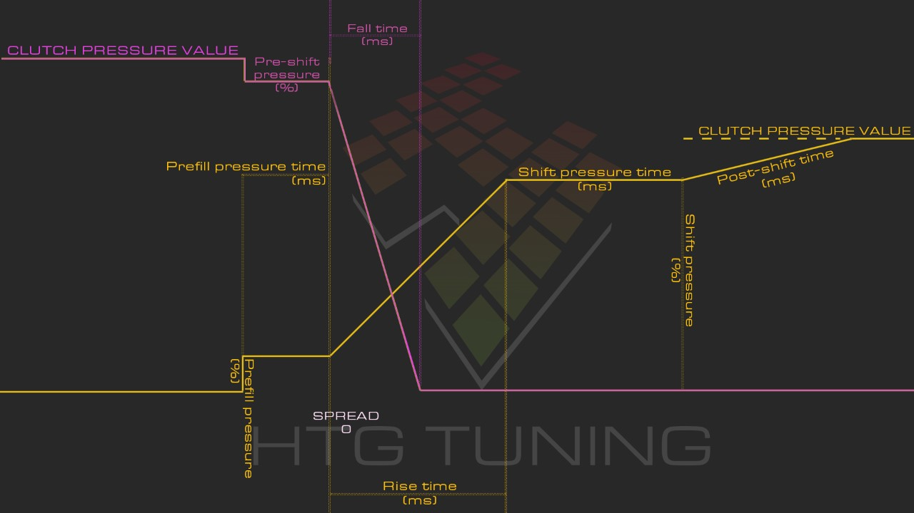

# Key Features

The information provided in this section utilizes calculations and maps similar to that of the HTG GCU, albeit optimized for use on our custom TCU. We must also take vehicle speed from the CAN bus, and use it to drive a brushless DC servo for our mechanical speedometer conversion.

## Data Needed

In order for proper control of the gearbox, we need to be able to take a few parameters from the ECU, as well as provide it with some data. Data collection should be abstract so it can be swapped out depending on the system being used, although this system will be optimized for use with Haltech ECUs.

The following information is needed from the ECU over the CAN bus:

1. Current Gear (Might not be CAN bus)
1. Engine RPM (Possibly not used)
1. Manifold Pressure (Possibly not used)
1. Throttle Position (Possibly not used)
1. Intake Air Temperature (Possibly not used)
1. Engine Load (%)

While the following information can be sent to the ECU via the CAN bus:

1. Gear Selector Switch
1. Transmission temperature

And finally, the ECU itself needs to be wired directly to these sensors:

1. Vehicle Speed Sensor (MCU control?)
1. Input Shaft Speed Sensor (MCU control?)
1. Line Pressure
1. Torque Converter Clutch

## Maps

The 6HP family of transmissions must be shifted in a "clutch to clutch" style of shifting, similar to a DCT. For this, we must "fade" between clutches in order to shift. Since multiple clutches or brakes are used to shift between gears, the timing of these gear shifts are the same across all clutches and are specified by the gear.

### Torque Estimation Algorithms

In order to accurately determine shifting characteristics, we must modulate the shifting speed based on estimated engine torque. We can do this with Engine Load provided by the ECU. We could also estimate torque via TPS/MAP and RPM. This could give us two possible maps for torque estimates:

1. Torque [nm or lbft]&nbsp;&nbsp;&nbsp;&nbsp;Axes: TPS/MAP, RPM
1. Torque [nm or lbft]&nbsp;&nbsp;&nbsp;&nbsp;Axes: Engine Load

### Shifting Algorithm

Using an open loop style tuning calculation, we can split the shifting into the following phases:

1. **Prefill**
1. **Shift**
1. **Post-shift**

Graph from [HTG's wiki](<https://update.htg-tuning.com/wiki/index.html#t=HTG_GCU_User_Guide%2FHTG_wiki_(internal)%2FHTG%2FShifting_tuning.html>)

### Prefill

In order to quickly perform a shift with minimal slipping and minimal RPM drop, it is important that our clutch packs are as close to engaged as we can possibly get. Once a shift is requested from the ECU, the prefill cycle begins. This leaves us with the following maps:

1. Prefill Pressure [%]&nbsp;&nbsp;&nbsp;&nbsp;Axes: Torque, Gear
1. Prefill Time [ms]&nbsp;&nbsp;&nbsp;&nbsp;&nbsp;&nbsp;&nbsp;&nbsp;Axes: Torque, Gear

In our simplified use case, the prefill pressure of the outgoing gear is simply 100% - [prefill pressure of incoming gear]

### Shift

Since our shifting style is similar to that of a DCT, we must "fade" the clutches appropriately. Each gear can be controlled to allow for different engagement and disengagement speeds. We also allow for the offset of gear transition to be changed, which allows for the gear aggressiveness to be altered. This leaves us the following maps:

1. Rise Time [ms]&nbsp;&nbsp;&nbsp;&nbsp;&nbsp;&nbsp;&nbsp;&nbsp;&nbsp;&nbsp;&nbsp;Axes: Torque, Gear
1. Fall Time [ms]&nbsp;&nbsp;&nbsp;&nbsp;&nbsp;&nbsp;&nbsp;&nbsp;&nbsp;&nbsp;&nbsp;&nbsp;Axes: Torque, Gear
1. Spread Time [ms]&nbsp;&nbsp;&nbsp;&nbsp;&nbsp;&nbsp;Axes: Torque, Gear

### Post-shift

To allow for better gear engagement, due to the physical limitations of the transmission, we do not fully engage the incoming clutch until after a specified period of time. We hold the clutch at a "shift pressure" for a given period of time, and then fade it to being fully engaged over time. This leaves us with the following maps:

1. Shift Pressure [%]&nbsp;&nbsp;&nbsp;&nbsp;&nbsp;&nbsp;&nbsp;&nbsp;&nbsp;&nbsp;&nbsp;&nbsp;&nbsp;&nbsp;&nbsp;Axes: Torque, Gear
1. Shift Pressure Time [ms]&nbsp;&nbsp;&nbsp;&nbsp;Axes: Torque, Gear
1. Post-shift Time [ms]&nbsp;&nbsp;&nbsp;&nbsp;&nbsp;&nbsp;&nbsp;&nbsp;&nbsp;&nbsp;&nbsp;Axes: Torque, Gear

#### ALL GEAR SHIFTS END AT 100% CLUTCH ENGAGEMENT

## Miscellaneous

The torque converter lockup is handled by the ECU, as well as throttle blip/cut on shift, shift duration, line pressure and any other torque reduction algorithms. Since the ECU believes it has direct control of the shift solenoids (similar to a 4L60E), as long as shift duration is set properly, any torque reduction or line pressure reduction should be timed properly with the shift request.
